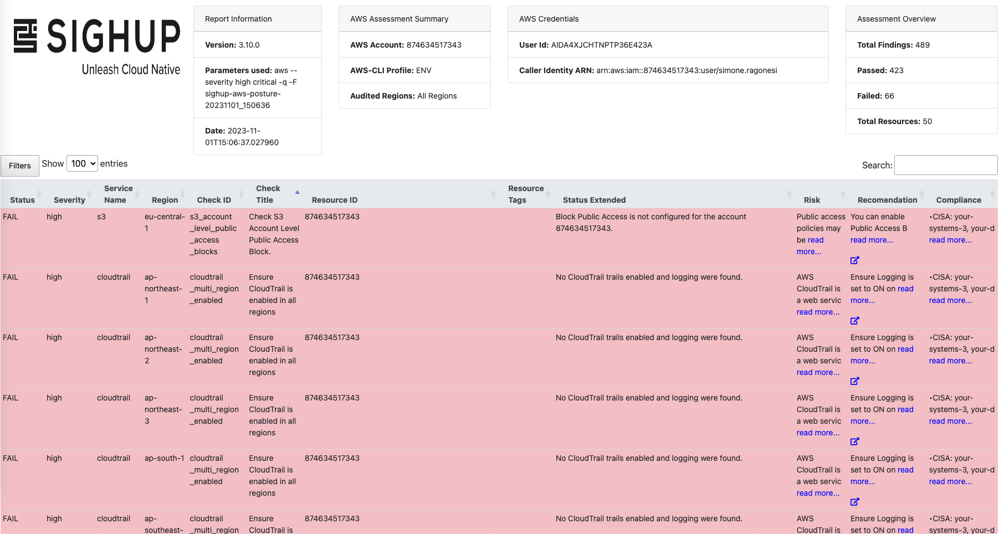

# Cloudit
[](https://github.com/rooted-io/cloudit/actions/workflows/ci.yaml)  [](https://github.com/rooted-io/cloudit/actions/workflows/release.yaml)  [](https://opensource.org/licenses/Apache-2.0)


Automatic Cloud Posture Audit Tool ☁️ 🔬  

 

## Abstract


`Cloudit` is a script for automatic, multicloud and  multi-tenant *CSPM* (Cloud Security Posture Management).  
The idea is to wrap some usefull open source cloud posture audit tools like [prowler](https://github.com/prowler-cloud/prowler)  behind an higher level abstraction in order to execute the tools in parallel on multiple customer's public cloud accounts.  

> **Warning**
> This tools makes API calls to cloud provider endpoints and services: these calls may be billed by the provider.  

As of right now this only work with `aws`, `azure` and `gcp` and uses json files to store customer credentials (inside the `credentials` folder).  
The *aws* credentials file is called `aws-credentials.json` and it is structured like this:  

```json
{
    "customers": [
        {
            "customer_name": "foo",
            "REGIONS": ["region-1", "region-2"],
            "SERVICES": ["aws_service_1", "aws_service_2"],
            "AWS_ACCESS_KEY_ID": "foo-access-key-here",
            "AWS_SECRET_ACCESS_KEY": "foo-secret-access-key-here",
        },
        {
            "customer_name": "donald",
            "REGIONS": ["region-1", "region-2", "region-3"],
            "SERVICES": ["aws_service_1", "aws_service_2", "aws_service_3"],
            "AWS_ACCESS_KEY_ID": "donald-access-key-here",
            "AWS_SECRET_ACCESS_KEY":"donald-secret-access-key-here"
        }

    ]
}
```   

The *azure* credentials file is called `azure-credentials.json` and it is structured like this:  

```json
{
    "customers": [
        {
            "customer_name": "foo",
            "SERVICES": ["defender", "iam"],
            "AZURE_CLIENT_ID": "foo-client-id-here",
            "AZURE_CLIENT_SECRET": "foo-client-secret-here",
            "AZURE_TENANT_ID": "foo-tenant-id-here",
            "AZURE_SUBSCRIPTION_ID":
            ["foo-subscription-id-1-here"]
        },
        {
            "customer_name": "donald",
            "SERVICES": ["defender", "iam"],
            "AZURE_CLIENT_ID": "donald-client-id-here",
            "AZURE_CLIENT_SECRET": "donald-client-secret-here",
            "AZURE_TENANT_ID": "donald-tenant-id-here",
            "AZURE_SUBSCRIPTION_ID":
            ["donald-subscription-id-1-here", "donald-subscription-id-2-here"]
        }

    ]
}
```   


The *gcp* credentials file is called `gcp-credentials.json` and it is structured like this:  

```json
{
    "customers": [
        {
            "customer_name": "customer-name-here",
            "SERVICES": ["iam", "dns"],
            "GOOGLE_APPLICATION_CREDENTIALS": "path-to-gcp-sa-json-file-here (eg. credentials/gcp/customer1-gcp-sa.json)"
        },
        {
            "customer_name": "customer-name-here",
            "SERVICES": ["iam", "dns"],
            "GOOGLE_APPLICATION_CREDENTIALS": "path-to-gcp-sa-json-file-here (eg. credentials/gcp/customer2-gcp-sa.json)"
        }

    ]
}
```   

> **Note**  
> To inspect available services with prowler run `prowler {provider} --list-services`  

This also want a path to the json file containing all the data for google service account authentication.  
You can put the files for every sa of every customer inside the `credentials/gcp` folder, and then reference them  
via the `GOOGLE_APPLICATION_CREDENTIALS` property of the `gcp-credentials.json` file.  

In the future, when the tool will become more mature, it will be almost mandatory to use a proper database engine.  

> **Note**
> Before launching the tool remember to install dependencies with `pip3 install -r requirements.txt`  

To launch the tool simply configure the various cloud provider credentials files and then use the following command:  
```console
python3 cloudit.py
```  

When a new git tag is pushed, for example:  
```console
 git tag -a v0.0.8 -m "0.0.8" && git push origin v0.0.8
```  
A [github action](https://github.com/rooted-io/cloudit/blob/main/.github/workflows/release.yaml) is triggered to produce a github release and a new OCI image that is pushed [here](https://packages).  


At the current time the tool produce for every customer-provider tuple a report in `csv`, `json` and `html` formats (3 files for every report).  
We are most interested in the html one, here is an example:  



